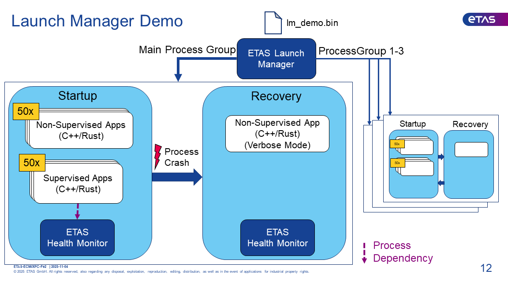
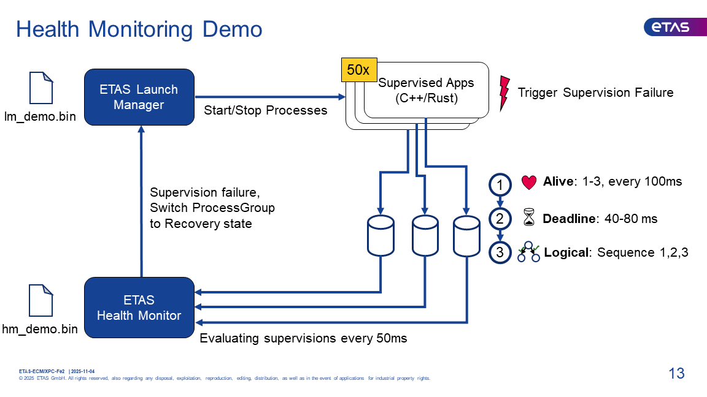

# Demo Setup

## Building & Running the demo setup

1. Build launch_manager and health_monitor, in the parent folder, first.
2. Then start run.sh script in this folder: `cd demo && ./run.sh`

The run.sh script will:

- Copy the required binaries to a temporary directory demo/tmp
- Compile the json configuration to flatbuffer using flatc
- Build a docker image for execution with the required artifacts inside
- Start the docker container that runs launch_manager

## Interacting with the Demo

### Changing ProcessGroup States

There is a CLI application that allows to request transition to a certain ProcessGroup State.

Example: `lmcontrol ProcessGroup1/Startup`

### Triggering Supervision Failure

There is a CLI command that allows to trigger a supervised app to misreport checkpoints.

Example: `fail <PID>`

## Demo Walkthrough

There is an interactive mode that walks you through two demo scenarios.
This mode requires the run.sh script to be executed **in an active tmux** session.

`cd demo && ./run.sh tmux`

There is also a recording of the demo available at [demo_recording.mp4](demo_recording.mp4).

### Demo Scenario 1: Launch Manager

* The system is setup with four ProcessGroups, each with a Startup and Recovery state.
* By default, only the Main ProcessGroup will be started in the Startup state and remaining ProcessGroups are off initially.
* The Startup state is starting the HealthMonitor + 100 application processes, 50 of which are supervised by the HealthMonitor.
* The Recovery state is just running a single application process, that is being restarted in verbose mode when transitioning from Startup to Recovery state.
* During the demo, a non-supervised application process is killed. Subsequently, LaunchManager is detecting the crash and moving the Main ProcessGroup to the Recovery state. Now, only a single application process is running with verbose logging showing up in the console.

### Demo Scenario 2: Health Monitor

* As explained above, the Main ProcessGroup contains 50 processes being supervised by the HealthMonitor.
* Each of these processes cyclically reports three checkpoints.
* For each of these processes, the HealthMonitor is evaluating an Alive, Deadline and Logical supervision every 50ms.
* During the demo, a supervised application is triggered to misreport checkpoints. Subsequently, supervisions for this application will fail and the HealthMonitor will initiate transition of the ProcessGroup into the Recovery state. Now, only a single application process is running with verbose logging showing up in the console.