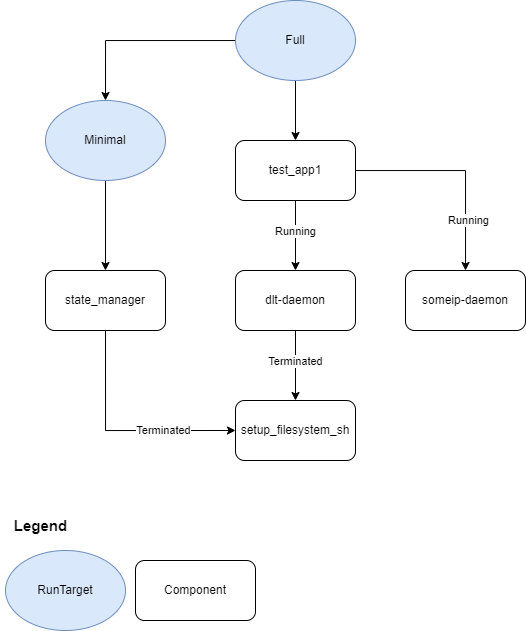

# Launch Manager Daemon Configuration Concept

## Version

The version of the configuration schema should be included in every configuration file.
When loading the configuration file at runtime, the launch_manager will check that it matches the supported schema version.

## Component vs deployment configuration

A component (also referred to as a software component) is an independent software unit - such as an application or a software container - that can be developed separately and subsequently deployed into a target system (for example machine). Components are usually combined into a functioning system during the deployment, or integration, phase.
Because a single component may be deployed into multiple systems, the deployment configuration is intentionally separated from the component properties. In summary:
* The **deployment configuration** defines information specific to a particular system setup.
* The **component properties** describe the fundamental characteristics of the software component, which are typically determined during that component’s development phase.

For illustration, please refer to the following example.

```json
"components": {
    "setup_filesystem_sh": {
        "component_properties": {
            "is_native_application": true,
            "is_supervised": false,
            "alive_supervision": {
                "reporting_cycle": 0.5,
                "failed_cycles_tolerance": 2,
                "min_indications": 1,
                "max_indications": 3
            },
            "is_self_terminating": true
        },
        "deployment_config": {
            "executable_path" : "/opt/scripts/setup_filesystem.sh",
            "process_arguments": ["-a", "-b"],
            "scheduling_policy": "SCHED_OTHER",
            "scheduling_priority": "0",
            "uid" : 1000,
            "gid" : 1000,
            "supplementary_group_ids": [500, 600, 700]
        }
    }
}
```

## Usage of Defaults

We should have a mechanism to define default values to avoid repetition of common properties.

### Proposal for first version: Default component and default deployment_config definition

In the `defaults` section of file, the user can define default values for component and deployment_config properties.
All keys have the identical names as used for the configuration of a concrete component / deployment_config.

```json
"defaults": {
    "deployment_config": {
        "startup_timeout": 0.5,
        "shutdown_timeout": 0.5,
        "uid" : 1000,
        "gid" : 1000,
        "supplementary_group_ids": [500, 600, 700],
        "environmental_variables": {
            "LD_LIBRARY_PATH": "/opt/lib",
            "EMPTY_ENV_VAR": ""
        },
        "process_arguments": [],
        "scheduling_policy": "SCHED_OTHER",
        "scheduling_priority": "0",
        ...
    },
    "component_properties": {
        "is_native_application": false,
        "is_supervised": true,
        "alive_supervision": {
            "reporting_cycle": 0.5,
            "failed_cycles_tolerance": 2,
            "min_indications": 1,
            "max_indications": 3
        },
        "is_self_terminating": false,
        "is_state_manager": false,
        "depends_on": []
    },
    "run_target": {
        "transition_timeout": 2
    }
}
```

Any setting not defined as part of a component or deployment_config definition will automatically use the default value.
Overwriting Behavior:
* Primitive values (like `uid`) simply get overwritten if configured
* Dictionaries (like `environmental_variables`) get merged. Keys can be overwritten by configuring the same keys.
* Lists (like `supplementary_group_ids`) get overwritten. In the future we may add further properties like `supplementary_group_ids_extend` to add to the default list instead of overwriting - if this use case gets necessary.

### Proposal for future extension: Defining different component and deployment_config templates

As per our discussion there may be a use case to have different kinds of components and different kinds of deployment configurations with their own defaults.
The approach above can be extended in this direction, by defining multiple deployment configurations and multiple components in the "defaults" section.
Component and deployment config definition could then refer to one of the predefined alternatives.

## Dependencies between components

Each dependency is configured as a json object, as we foresee that further properties might be added to the dependency in the future (i.e. support for kinds of dependencies).

Initially (when mapping the new configuration to the existing software), the component states are identical to the process state:
* `Running`: The process finished initialization (or is a self-terminating processes)
* `Terminated`: The process terminated

```json
"components": {
    "test_app2": {
        "component_properties": {
            "depends_on": {
                "test_app4": {
                    "required_state": "Running"
                }
            }
        }
    }
}
```

## Supported component properties

Currently following component properties are supported:
* `is_native_application`: Property describing if component is using S-CORE platform functionality (true / false).
* `is_supervised`: Property describing if component sends alive notifications to Launch Manager (true / false).
* `alive_supervision`: Description of alive monitoring, that should be applied to this component.
  * `reporting_cycle`: Property describing the duration of time period, used for evaluation of alive supervision.
  * `failed_cycles_tolerance`: Property describing number of reporting cycles (see `reporting_cycle`) that could fail in a row, before recovery action will be triggered.
  * `min_indications`: Property describing minimal number of checkpoints, that shall be reported in a given `reporting_cycle`.
  * `max_indications`: Property describing maximal number of checkpoints, that can be reported in a given `reporting_cycle`.
* `is_self_terminating`: Property describing if component intends to terminate on its own after startup. Please note that daemons usually stay running and waits for termination request from Launch Manager (true / false).
* `is_state_manager`: Property describing if component needs access to the API that changes current Run Target (true / false).
* `depends_on`: List of components on which this component depends.

## Supported deployment configuration elements

Currently following configuration elements are supported:
* `startup_timeout`: Period of time in which, `running` notification should be reported from the component to the Launch Manager. This timeout is measured from the moment the child process is created, till notification is received by LM.
* `shutdown_timeout`: Period of time in which component should terminate, after receiving SIGTERM signal from Launch Manager. This timeout is measured from the moment LM sends SIGTERM, till Operating System (OS) notifies LM that child process finished execution.
* `uid`: POSIX User ID assigned to this component.
* `gid`: POSIX Group ID assigned to this component.
* `supplementary_group_ids`: List of supplementary group IDs, that are assigned to this component.
* `security_policy`: Name of the security policy assigned to this component.
* `environmental_variables`: List of environmental variables that should be passed to this component.
* `process_arguments`: List of arguments, also know as command line arguments, that should be passed to this component.
* `scheduling_policy`: Scheduling policy that should be applied to the first thread of this component.
* `scheduling_priority`: Scheduling priority that should be applied to the first thread of this component.
* `working_directory`: Working directory that should be set for this component.
* `restarts_during_startup`: If component does not send `running` notification in time, see `startup_timeout` configuration for more details, Launch Manager will consider this a startup failure. This setting specify how many more times LM should try to start this component, before giving up and considering Run Target transition to fail. If `restarts_during_startup` is set to 0 (zero), no restart attempts will be performed and Run Target transition will fail immediately.
* `resource_limits`: Resource limitations that should be applied to this component.
  * `memory_usage`: Maximum memory (in bytes) that can be consumed by this component during runtime.

## Assignment to RunTargets

For every dependency, the required state of the component is implicitly "Running".

```json
"run_targets": {
    "run_target_01": {
        "description": "Example description of a Run Target number 01.",
        "includes": {
            "components": ["test_app1"]
        }
    }
    ...
}
```

## Timeout Values

All time periods will be configured in seconds. If a smaller time period is needed, then a fraction numbers should be used. For example we should use `0.001` for one millisecond timeout value.

## Configuration Example



```json
{
    "schema_version": 1,
    "defaults": {
        "deployment_config": {
            "startup_timeout": 0.5,
            "shutdown_timeout": 0.5,
            "uid" : 1000,
            "gid" : 1000,
            "supplementary_group_ids": [500, 600, 700],
            "security_policy": "",
            "environmental_variables": {
                "LD_LIBRARY_PATH": "/opt/lib",
                "GLOBAL_ENV_VAR": "abc",
                "EMPTY_GLOBAL_ENV_VAR": ""
            },
            "process_arguments": [],
            "scheduling_policy": "SCHED_OTHER",
            "scheduling_priority": "0",
            "working_directory": "/tmp",
            "resource_limits": {}
        },
        "component_properties": {
            "is_native_application": false,
            "is_supervised": true,
            "alive_supervision": {
                "reporting_cycle": 0.5,
                "failed_cycles_tolerance": 2,
                "min_indications": 1,
                "max_indications": 3
            },
            "is_self_terminating": false,
            "is_state_manager": false,
            "depends_on": []
        },
        "run_target": {
            "transition_timeout": 2
        }
    },
    "components": {
        "setup_filesystem_sh": {
            "component_properties": {
                "is_native_application": true,
                "is_supervised": false,
                "is_self_terminating": true
            },
            "deployment_config": {
                "executable_path" : "/opt/scripts/setup_filesystem.sh",
                "process_arguments": ["-a", "-b"]
            }
        },
        "dlt-daemon": {
            "component_properties": {
                "is_native_application": true,
                "is_supervised": false,
                "depends_on": {
                    "setup_filesystem_sh": {
                        "required_state": "Terminated"
                    }
                }
            },
            "deployment_config": {
                "executable_path" : "/opt/apps/dlt-daemon/dltd"
            }
        },
        "someip-daemon": {
            "deployment_config": {
                "executable_path" : "/opt/apps/someip/someipd"
            }
        },
        "test_app1": {
            "component_properties": {
                "depends_on": {
                    "dlt-daemon": {
                        "required_state": "Running"
                    },
                    "someip-daemon": {
                        "required_state": "Running"
                    }
                }
            },
            "deployment_config": {
                "executable_path" : "/opt/apps/test_app1/test_app1"
            }
        },
        "state_manager": {
            "component_properties": {
                "is_state_manager": true,
                "depends_on": {
                    "setup_filesystem_sh": {
                        "required_state": "Terminated"
                    }
                }
            },
            "deployment_config": {
                "executable_path" : "/opt/apps/state_manager/sm"
            }
        }
    },
    "run_targets": {
        "Minimal": {
            "description": "Minimal functionality of the system",
            "includes": {
                "components": ["state_manager"]
            }
        },
        "Full": {
            "description": "Everything running",
            "includes": {
                "components": ["test_app1"],
                "run_targets": ["Minimal"]
            },
            "transition_timeout": 5
        },
        "Off": {
            "description": "Nothing is running"
        },
        "initial_run_target": "Minimal"
    },
    "health_monitoring" : {
        "evaluation_cycle": 0.5,
        "watchdogs": {
            "simple_watchdog": {
                "device_file_path": "/dev/watchdog",
                "max_timeout": 2,
                "deactivate_on_shutdown": true,
                "require_magic_close": false
            }
        }
    }
}
```

## Open Topics

### RecoveryAction

In the initial version (mapping to the config to the existing software) the only supported RecoveryAction will be to switch to a predefined recovery RunTarget in case of any error.

How to define the SwitchRunTarget RecoveryAction without entangling the component definition with the RunTarget definition?

### Execution dependencies: Component State vs. Process State

For the initial version, it will be easiest to have component state identical to process state as this is already supported by the existing code.

### How to configure the initial RunTarget

Should we reserve a name for the initial RunTarget or make this configurable (see `initial_run_target`)?

### Defining json schema

After agreement on the rough structure, we will define a json schema depicting all possible configuration options.
