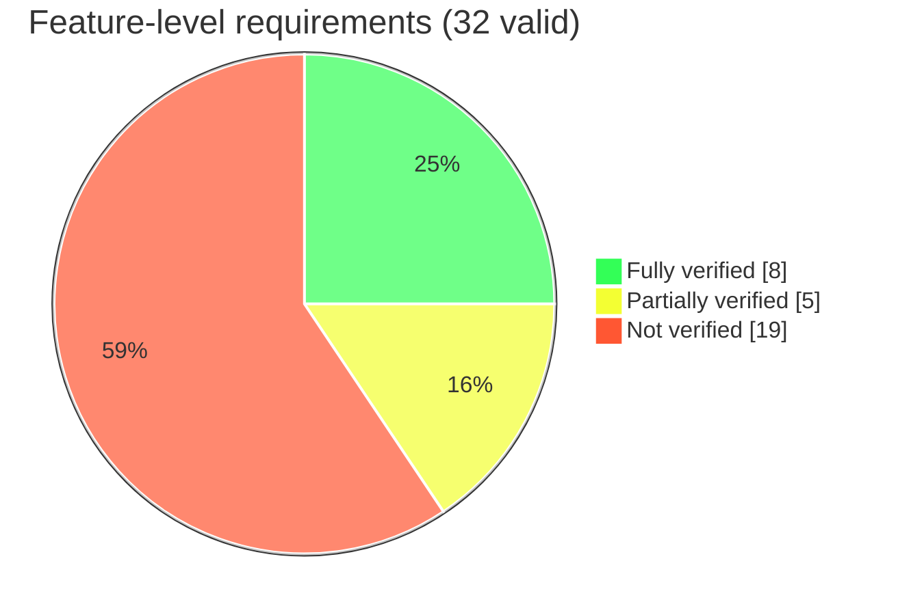
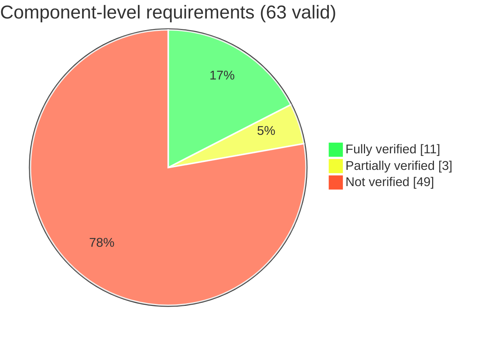

# Integration Test Coverage Report

_Generated: 2026-09-10_

This report reflects the current status of **integration test** coverage for the
Lifecycle **feature-level** requirements and the Launch Manager **component-level**
requirements. Only requirements with `:status: valid` are considered.

**Sources**

- Feature-level requirements: [Lifecycle feature requirements](https://eclipse-score.github.io/score/main/features/lifecycle/requirements/index.html) — 32 requirements, all `valid`.
- Component-level requirements: [Launch Manager component requirements](https://eclipse-score.github.io/lifecycle/main/components/launch_manager/requirements/requirements.html) — 63 requirements, all `valid`.
- Integration tests: [tests/integration/](https://github.com/eclipse-score/lifecycle/tree/main/tests/integration) — 21 Python test files, scanned for `fully_verifies` / `partially_verifies`.

---

## Methodology

Each integration test declares `fully_verifies=[...]` and `partially_verifies=[...]`
lists of requirement IDs.

**Component-level status** (per requirement):

- **Fully verified** — at least one test lists it in `fully_verifies`.
- **Partially verified** — no test fully verifies it, but at least one test lists it in `partially_verifies`.
- **Not verified** — no test references it.

**Feature-level status** combines *direct* verification (a test naming the `feat_req__*`
ID directly) with *derived* verification (the status of the `comp_req__*` requirements
that were `derived_from` the feature):

- **Fully verified** — all derived component requirements are fully verified, **or**
  a test directly fully verifies the feature and no derived component requirement is only partially verified.
- **Partially verified** — at least one derived component requirement is only partially verified,
  **or** a test directly verifies the feature only partially, **or** the derived component
  requirements are a mix of verified/unverified.
- **Not verified** — all derived component requirements are not verified **and** no test verifies the feature itself.

> Note: two features (`terminationn_dependency`, `monitor_abnormal_term`) are directly
> `fully_verifies`-annotated by a test but have a derived component requirement that is only
> *partially* verified, so per the rule above they are counted as **partially verified**.

---

## Summary Table

| Requirement level | Total (valid) | Not verified | Partially verified | Fully verified |
|---|---:|---:|---:|---:|
| **Feature-level requirements** | 32 | 19 | 5 | 8 |
| **Component-level requirements** | 63 | 49 | 3 | 11 |

| Integration tests | Count |
|---|---:|
| Total test files | 21 |
| Tests linking ≥1 requirement | 15 |
| Tests with no requirement link | 6 |

---

## Feature-Level Requirement Coverage

| Status | Count | Share |
|---|---:|---:|
| Fully verified | 8 | 25.0% |
| Partially verified | 5 | 15.6% |
| Not verified | 19 | 59.4% |

**Fully verified (8):** [`launch_support`](https://eclipse-score.github.io/score/main/features/lifecycle/requirements/index.html#feat_req__lifecycle__launch_support), [`process_ordering`](https://eclipse-score.github.io/score/main/features/lifecycle/requirements/index.html#feat_req__lifecycle__process_ordering), [`parallel_launch_support`](https://eclipse-score.github.io/score/main/features/lifecycle/requirements/index.html#feat_req__lifecycle__parallel_launch_support), [`start_named_run_target`](https://eclipse-score.github.io/score/main/features/lifecycle/requirements/index.html#feat_req__lifecycle__start_named_run_target), [`switch_run_targets`](https://eclipse-score.github.io/score/main/features/lifecycle/requirements/index.html#feat_req__lifecycle__switch_run_targets), [`process_termination`](https://eclipse-score.github.io/score/main/features/lifecycle/requirements/index.html#feat_req__lifecycle__process_termination), [`request_run_target_start`](https://eclipse-score.github.io/score/main/features/lifecycle/requirements/index.html#feat_req__lifecycle__request_run_target_start), [`recov_run_target_switch`](https://eclipse-score.github.io/score/main/features/lifecycle/requirements/index.html#feat_req__lifecycle__recov_run_target_switch)

**Partially verified (5):** [`custom_cond_support`](https://eclipse-score.github.io/score/main/features/lifecycle/requirements/index.html#feat_req__lifecycle__custom_cond_support), [`conditional_startup`](https://eclipse-score.github.io/score/main/features/lifecycle/requirements/index.html#feat_req__lifecycle__conditional_startup), [`terminationn_dependency`](https://eclipse-score.github.io/score/main/features/lifecycle/requirements/index.html#feat_req__lifecycle__terminationn_dependency), [`monitor_abnormal_term`](https://eclipse-score.github.io/score/main/features/lifecycle/requirements/index.html#feat_req__lifecycle__monitor_abnormal_term), [`recovery_action_support`](https://eclipse-score.github.io/score/main/features/lifecycle/requirements/index.html#feat_req__lifecycle__recovery_action_support)

**Not verified (19):** [`running_processes`](https://eclipse-score.github.io/score/main/features/lifecycle/requirements/index.html#feat_req__lifecycle__running_processes), [`oci_compliant`](https://eclipse-score.github.io/score/main/features/lifecycle/requirements/index.html#feat_req__lifecycle__oci_compliant), [`run_target_support`](https://eclipse-score.github.io/score/main/features/lifecycle/requirements/index.html#feat_req__lifecycle__run_target_support), [`control_commands`](https://eclipse-score.github.io/score/main/features/lifecycle/requirements/index.html#feat_req__lifecycle__control_commands), [`query_commands`](https://eclipse-score.github.io/score/main/features/lifecycle/requirements/index.html#feat_req__lifecycle__query_commands), [`controlif_status`](https://eclipse-score.github.io/score/main/features/lifecycle/requirements/index.html#feat_req__lifecycle__controlif_status), [`smart_watchdog_config`](https://eclipse-score.github.io/score/main/features/lifecycle/requirements/index.html#feat_req__lifecycle__smart_watchdog_config), [`liveliness_detection`](https://eclipse-score.github.io/score/main/features/lifecycle/requirements/index.html#feat_req__lifecycle__liveliness_detection), [`multi_instance_support`](https://eclipse-score.github.io/score/main/features/lifecycle/requirements/index.html#feat_req__lifecycle__multi_instance_support), [`lm_self_health_check`](https://eclipse-score.github.io/score/main/features/lifecycle/requirements/index.html#feat_req__lifecycle__lm_self_health_check), [`prog_lang`](https://eclipse-score.github.io/score/main/features/lifecycle/requirements/index.html#feat_req__lifecycle__prog_lang), [`hm_deadline`](https://eclipse-score.github.io/score/main/features/lifecycle/requirements/index.html#feat_req__lifecycle__hm_deadline), [`hm_logical`](https://eclipse-score.github.io/score/main/features/lifecycle/requirements/index.html#feat_req__lifecycle__hm_logical), [`hm_checkpoint`](https://eclipse-score.github.io/score/main/features/lifecycle/requirements/index.html#feat_req__lifecycle__hm_checkpoint), [`logging_support`](https://eclipse-score.github.io/score/main/features/lifecycle/requirements/index.html#feat_req__lifecycle__logging_support), [`config_file_support`](https://eclipse-score.github.io/score/main/features/lifecycle/requirements/index.html#feat_req__lifecycle__config_file_support), [`session_extension`](https://eclipse-score.github.io/score/main/features/lifecycle/requirements/index.html#feat_req__lifecycle__session_extension), [`component_group_config`](https://eclipse-score.github.io/score/main/features/lifecycle/requirements/index.html#feat_req__lifecycle__component_group_config), [`deps_visualization`](https://eclipse-score.github.io/score/main/features/lifecycle/requirements/index.html#feat_req__lifecycle__deps_visualization)

---

## Component-Level Requirement Coverage

| Status | Count | Share |
|---|---:|---:|
| Fully verified | 11 | 17.5% |
| Partially verified | 3 | 4.8% |
| Not verified | 49 | 77.8% |

**Fully verified (11):** [`process_launch_args`](https://eclipse-score.github.io/lifecycle/main/components/launch_manager/requirements/requirements.html#comp_req__launch_man__process_launch_args), [`uid_gid_support`](https://eclipse-score.github.io/lifecycle/main/components/launch_manager/requirements/requirements.html#comp_req__launch_man__uid_gid_support), [`launch_priority_support`](https://eclipse-score.github.io/lifecycle/main/components/launch_manager/requirements/requirements.html#comp_req__launch_man__launch_priority_support), [`cwd_support`](https://eclipse-score.github.io/lifecycle/main/components/launch_manager/requirements/requirements.html#comp_req__launch_man__cwd_support), [`supplementary_groups`](https://eclipse-score.github.io/lifecycle/main/components/launch_manager/requirements/requirements.html#comp_req__launch_man__supplementary_groups), [`scheduling_policy`](https://eclipse-score.github.io/lifecycle/main/components/launch_manager/requirements/requirements.html#comp_req__launch_man__scheduling_policy), [`retries_configurable`](https://eclipse-score.github.io/lifecycle/main/components/launch_manager/requirements/requirements.html#comp_req__launch_man__retries_configurable), [`process_state_comm`](https://eclipse-score.github.io/lifecycle/main/components/launch_manager/requirements/requirements.html#comp_req__launch_man__process_state_comm), [`launch_manager_shutdown`](https://eclipse-score.github.io/lifecycle/main/components/launch_manager/requirements/requirements.html#comp_req__launch_man__launch_manager_shutdown), [`failure_detect`](https://eclipse-score.github.io/lifecycle/main/components/launch_manager/requirements/requirements.html#comp_req__launch_man__failure_detect), [`shutdown_signal`](https://eclipse-score.github.io/lifecycle/main/components/launch_manager/requirements/requirements.html#comp_req__launch_man__shutdown_signal)

**Partially verified (3):** [`path_condition_check`](https://eclipse-score.github.io/lifecycle/main/components/launch_manager/requirements/requirements.html#comp_req__launch_man__path_condition_check), [`launcher_exit_shutdown`](https://eclipse-score.github.io/lifecycle/main/components/launch_manager/requirements/requirements.html#comp_req__launch_man__launcher_exit_shutdown), [`ext_monitor_notify`](https://eclipse-score.github.io/lifecycle/main/components/launch_manager/requirements/requirements.html#comp_req__launch_man__ext_monitor_notify)

**Not verified (49):** all remaining valid component requirements.

---

## Not Verified — Detailed Lists

### Not verified feature-level requirements (19)

| # | Feature requirement ID | Title |
|---:|---|---|
| 1 | [`feat_req__lifecycle__running_processes`](https://eclipse-score.github.io/score/main/features/lifecycle/requirements/index.html#feat_req__lifecycle__running_processes) | Process adoption |
| 2 | [`feat_req__lifecycle__oci_compliant`](https://eclipse-score.github.io/score/main/features/lifecycle/requirements/index.html#feat_req__lifecycle__oci_compliant) | OCI Compliant |
| 3 | [`feat_req__lifecycle__run_target_support`](https://eclipse-score.github.io/score/main/features/lifecycle/requirements/index.html#feat_req__lifecycle__run_target_support) | Run target support |
| 4 | [`feat_req__lifecycle__control_commands`](https://eclipse-score.github.io/score/main/features/lifecycle/requirements/index.html#feat_req__lifecycle__control_commands) | Control commands |
| 5 | [`feat_req__lifecycle__query_commands`](https://eclipse-score.github.io/score/main/features/lifecycle/requirements/index.html#feat_req__lifecycle__query_commands) | Query commands |
| 6 | [`feat_req__lifecycle__controlif_status`](https://eclipse-score.github.io/score/main/features/lifecycle/requirements/index.html#feat_req__lifecycle__controlif_status) | Report "started/running/degraded" |
| 7 | [`feat_req__lifecycle__smart_watchdog_config`](https://eclipse-score.github.io/score/main/features/lifecycle/requirements/index.html#feat_req__lifecycle__smart_watchdog_config) | Monitoring and recovery: watchdog support |
| 8 | [`feat_req__lifecycle__liveliness_detection`](https://eclipse-score.github.io/score/main/features/lifecycle/requirements/index.html#feat_req__lifecycle__liveliness_detection) | Process liveliness detection |
| 9 | [`feat_req__lifecycle__multi_instance_support`](https://eclipse-score.github.io/score/main/features/lifecycle/requirements/index.html#feat_req__lifecycle__multi_instance_support) | Multi-instance |
| 10 | [`feat_req__lifecycle__lm_self_health_check`](https://eclipse-score.github.io/score/main/features/lifecycle/requirements/index.html#feat_req__lifecycle__lm_self_health_check) | Launch manager self health check |
| 11 | [`feat_req__lifecycle__prog_lang`](https://eclipse-score.github.io/score/main/features/lifecycle/requirements/index.html#feat_req__lifecycle__prog_lang) | Lifecycle programing language support |
| 12 | [`feat_req__lifecycle__hm_deadline`](https://eclipse-score.github.io/score/main/features/lifecycle/requirements/index.html#feat_req__lifecycle__hm_deadline) | Health Monitor deadline supervision |
| 13 | [`feat_req__lifecycle__hm_logical`](https://eclipse-score.github.io/score/main/features/lifecycle/requirements/index.html#feat_req__lifecycle__hm_logical) | Health Monitor logical supervision |
| 14 | [`feat_req__lifecycle__hm_checkpoint`](https://eclipse-score.github.io/score/main/features/lifecycle/requirements/index.html#feat_req__lifecycle__hm_checkpoint) | Health Monitor checkpoint supervision |
| 15 | [`feat_req__lifecycle__logging_support`](https://eclipse-score.github.io/score/main/features/lifecycle/requirements/index.html#feat_req__lifecycle__logging_support) | Logging support |
| 16 | [`feat_req__lifecycle__config_file_support`](https://eclipse-score.github.io/score/main/features/lifecycle/requirements/index.html#feat_req__lifecycle__config_file_support) | Configuration file support |
| 17 | [`feat_req__lifecycle__session_extension`](https://eclipse-score.github.io/score/main/features/lifecycle/requirements/index.html#feat_req__lifecycle__session_extension) | Updating configuration |
| 18 | [`feat_req__lifecycle__component_group_config`](https://eclipse-score.github.io/score/main/features/lifecycle/requirements/index.html#feat_req__lifecycle__component_group_config) | Component grouping configuration |
| 19 | [`feat_req__lifecycle__deps_visualization`](https://eclipse-score.github.io/score/main/features/lifecycle/requirements/index.html#feat_req__lifecycle__deps_visualization) | Configuration Dependency view |

### Not verified component-level requirements (49)

| # | Component requirement ID | Derived from (feature) |
|---:|---|---|
| 1 | [`comp_req__launch_man__process_input_output`](https://eclipse-score.github.io/lifecycle/main/components/launch_manager/requirements/requirements.html#comp_req__launch_man__process_input_output) | [`custom_cond_support`](https://eclipse-score.github.io/score/main/features/lifecycle/requirements/index.html#feat_req__lifecycle__custom_cond_support) |
| 2 | [`comp_req__launch_man__debug_support`](https://eclipse-score.github.io/lifecycle/main/components/launch_manager/requirements/requirements.html#comp_req__launch_man__debug_support) | [`custom_cond_support`](https://eclipse-score.github.io/score/main/features/lifecycle/requirements/index.html#feat_req__lifecycle__custom_cond_support) |
| 3 | [`comp_req__launch_man__support_held_state`](https://eclipse-score.github.io/lifecycle/main/components/launch_manager/requirements/requirements.html#comp_req__launch_man__support_held_state) | [`custom_cond_support`](https://eclipse-score.github.io/score/main/features/lifecycle/requirements/index.html#feat_req__lifecycle__custom_cond_support) |
| 4 | [`comp_req__launch_man__terminal_support`](https://eclipse-score.github.io/lifecycle/main/components/launch_manager/requirements/requirements.html#comp_req__launch_man__terminal_support) | [`custom_cond_support`](https://eclipse-score.github.io/score/main/features/lifecycle/requirements/index.html#feat_req__lifecycle__custom_cond_support) |
| 5 | [`comp_req__launch_man__std_handle_redir`](https://eclipse-score.github.io/lifecycle/main/components/launch_manager/requirements/requirements.html#comp_req__launch_man__std_handle_redir) | [`custom_cond_support`](https://eclipse-score.github.io/score/main/features/lifecycle/requirements/index.html#feat_req__lifecycle__custom_cond_support) |
| 6 | [`comp_req__launch_man__secpol_non_root`](https://eclipse-score.github.io/lifecycle/main/components/launch_manager/requirements/requirements.html#comp_req__launch_man__secpol_non_root) | [`custom_cond_support`](https://eclipse-score.github.io/score/main/features/lifecycle/requirements/index.html#feat_req__lifecycle__custom_cond_support) |
| 7 | [`comp_req__launch_man__capability_support`](https://eclipse-score.github.io/lifecycle/main/components/launch_manager/requirements/requirements.html#comp_req__launch_man__capability_support) | [`custom_cond_support`](https://eclipse-score.github.io/score/main/features/lifecycle/requirements/index.html#feat_req__lifecycle__custom_cond_support) |
| 8 | [`comp_req__launch_man__fd_inheritance`](https://eclipse-score.github.io/lifecycle/main/components/launch_manager/requirements/requirements.html#comp_req__launch_man__fd_inheritance) | [`custom_cond_support`](https://eclipse-score.github.io/score/main/features/lifecycle/requirements/index.html#feat_req__lifecycle__custom_cond_support) |
| 9 | [`comp_req__launch_man__support_secpol_type`](https://eclipse-score.github.io/lifecycle/main/components/launch_manager/requirements/requirements.html#comp_req__launch_man__support_secpol_type) | [`custom_cond_support`](https://eclipse-score.github.io/score/main/features/lifecycle/requirements/index.html#feat_req__lifecycle__custom_cond_support) |
| 10 | [`comp_req__launch_man__runmask_support`](https://eclipse-score.github.io/lifecycle/main/components/launch_manager/requirements/requirements.html#comp_req__launch_man__runmask_support) | [`custom_cond_support`](https://eclipse-score.github.io/score/main/features/lifecycle/requirements/index.html#feat_req__lifecycle__custom_cond_support) |
| 11 | [`comp_req__launch_man__aslr_support`](https://eclipse-score.github.io/lifecycle/main/components/launch_manager/requirements/requirements.html#comp_req__launch_man__aslr_support) | [`custom_cond_support`](https://eclipse-score.github.io/score/main/features/lifecycle/requirements/index.html#feat_req__lifecycle__custom_cond_support) |
| 12 | [`comp_req__launch_man__process_rlimit_support`](https://eclipse-score.github.io/lifecycle/main/components/launch_manager/requirements/requirements.html#comp_req__launch_man__process_rlimit_support) | [`custom_cond_support`](https://eclipse-score.github.io/score/main/features/lifecycle/requirements/index.html#feat_req__lifecycle__custom_cond_support) |
| 13 | [`comp_req__launch_man__detach_parent_process`](https://eclipse-score.github.io/lifecycle/main/components/launch_manager/requirements/requirements.html#comp_req__launch_man__detach_parent_process) | [`custom_cond_support`](https://eclipse-score.github.io/score/main/features/lifecycle/requirements/index.html#feat_req__lifecycle__custom_cond_support) |
| 14 | [`comp_req__launch_man__cond_process_start`](https://eclipse-score.github.io/lifecycle/main/components/launch_manager/requirements/requirements.html#comp_req__launch_man__cond_process_start) | [`conditional_startup`](https://eclipse-score.github.io/score/main/features/lifecycle/requirements/index.html#feat_req__lifecycle__conditional_startup) |
| 15 | [`comp_req__launch_man__total_wait_time_support`](https://eclipse-score.github.io/lifecycle/main/components/launch_manager/requirements/requirements.html#comp_req__launch_man__total_wait_time_support) | [`conditional_startup`](https://eclipse-score.github.io/score/main/features/lifecycle/requirements/index.html#feat_req__lifecycle__conditional_startup) |
| 16 | [`comp_req__launch_man__polling_interval`](https://eclipse-score.github.io/lifecycle/main/components/launch_manager/requirements/requirements.html#comp_req__launch_man__polling_interval) | [`conditional_startup`](https://eclipse-score.github.io/score/main/features/lifecycle/requirements/index.html#feat_req__lifecycle__conditional_startup) |
| 17 | [`comp_req__launch_man__validate_conditions`](https://eclipse-score.github.io/lifecycle/main/components/launch_manager/requirements/requirements.html#comp_req__launch_man__validate_conditions) | [`conditional_startup`](https://eclipse-score.github.io/score/main/features/lifecycle/requirements/index.html#feat_req__lifecycle__conditional_startup) |
| 18 | [`comp_req__launch_man__validation_conditions`](https://eclipse-score.github.io/lifecycle/main/components/launch_manager/requirements/requirements.html#comp_req__launch_man__validation_conditions) | [`conditional_startup`](https://eclipse-score.github.io/score/main/features/lifecycle/requirements/index.html#feat_req__lifecycle__conditional_startup) |
| 19 | [`comp_req__launch_man__launcher_status_storage`](https://eclipse-score.github.io/lifecycle/main/components/launch_manager/requirements/requirements.html#comp_req__launch_man__launcher_status_storage) | [`conditional_startup`](https://eclipse-score.github.io/score/main/features/lifecycle/requirements/index.html#feat_req__lifecycle__conditional_startup) |
| 20 | [`comp_req__launch_man__condition_check_method`](https://eclipse-score.github.io/lifecycle/main/components/launch_manager/requirements/requirements.html#comp_req__launch_man__condition_check_method) | [`conditional_startup`](https://eclipse-score.github.io/score/main/features/lifecycle/requirements/index.html#feat_req__lifecycle__conditional_startup) |
| 21 | [`comp_req__launch_man__config_actions_cond`](https://eclipse-score.github.io/lifecycle/main/components/launch_manager/requirements/requirements.html#comp_req__launch_man__config_actions_cond) | [`conditional_startup`](https://eclipse-score.github.io/score/main/features/lifecycle/requirements/index.html#feat_req__lifecycle__conditional_startup) |
| 22 | [`comp_req__launch_man__env_variable_cond_check`](https://eclipse-score.github.io/lifecycle/main/components/launch_manager/requirements/requirements.html#comp_req__launch_man__env_variable_cond_check) | [`conditional_startup`](https://eclipse-score.github.io/score/main/features/lifecycle/requirements/index.html#feat_req__lifecycle__conditional_startup) |
| 23 | [`comp_req__launch_man__dependency_check`](https://eclipse-score.github.io/lifecycle/main/components/launch_manager/requirements/requirements.html#comp_req__launch_man__dependency_check) | [`conditional_startup`](https://eclipse-score.github.io/score/main/features/lifecycle/requirements/index.html#feat_req__lifecycle__conditional_startup) |
| 24 | [`comp_req__launch_man__check_dependency_exec`](https://eclipse-score.github.io/lifecycle/main/components/launch_manager/requirements/requirements.html#comp_req__launch_man__check_dependency_exec) | [`conditional_startup`](https://eclipse-score.github.io/score/main/features/lifecycle/requirements/index.html#feat_req__lifecycle__conditional_startup) |
| 25 | [`comp_req__launch_man__define_swc_dependencies`](https://eclipse-score.github.io/lifecycle/main/components/launch_manager/requirements/requirements.html#comp_req__launch_man__define_swc_dependencies) | [`conditional_startup`](https://eclipse-score.github.io/score/main/features/lifecycle/requirements/index.html#feat_req__lifecycle__conditional_startup) |
| 26 | [`comp_req__launch_man__configurable_wait_time`](https://eclipse-score.github.io/lifecycle/main/components/launch_manager/requirements/requirements.html#comp_req__launch_man__configurable_wait_time) | [`conditional_startup`](https://eclipse-score.github.io/score/main/features/lifecycle/requirements/index.html#feat_req__lifecycle__conditional_startup) |
| 27 | [`comp_req__launch_man__drop_supervsion`](https://eclipse-score.github.io/lifecycle/main/components/launch_manager/requirements/requirements.html#comp_req__launch_man__drop_supervsion) | [`running_processes`](https://eclipse-score.github.io/score/main/features/lifecycle/requirements/index.html#feat_req__lifecycle__running_processes) |
| 28 | [`comp_req__launch_man__multi_start_support`](https://eclipse-score.github.io/lifecycle/main/components/launch_manager/requirements/requirements.html#comp_req__launch_man__multi_start_support) | [`running_processes`](https://eclipse-score.github.io/score/main/features/lifecycle/requirements/index.html#feat_req__lifecycle__running_processes) |
| 29 | [`comp_req__launch_man__consistent_dependencies`](https://eclipse-score.github.io/lifecycle/main/components/launch_manager/requirements/requirements.html#comp_req__launch_man__consistent_dependencies) | [`running_processes`](https://eclipse-score.github.io/score/main/features/lifecycle/requirements/index.html#feat_req__lifecycle__running_processes) |
| 30 | [`comp_req__launch_man__stop_process_dependents`](https://eclipse-score.github.io/lifecycle/main/components/launch_manager/requirements/requirements.html#comp_req__launch_man__stop_process_dependents) | [`running_processes`](https://eclipse-score.github.io/score/main/features/lifecycle/requirements/index.html#feat_req__lifecycle__running_processes) |
| 31 | [`comp_req__launch_man__stop_order_spec`](https://eclipse-score.github.io/lifecycle/main/components/launch_manager/requirements/requirements.html#comp_req__launch_man__stop_order_spec) | [`running_processes`](https://eclipse-score.github.io/score/main/features/lifecycle/requirements/index.html#feat_req__lifecycle__running_processes) |
| 32 | [`comp_req__launch_man__configurable_timeout`](https://eclipse-score.github.io/lifecycle/main/components/launch_manager/requirements/requirements.html#comp_req__launch_man__configurable_timeout) | [`switch_run_targets`](https://eclipse-score.github.io/score/main/features/lifecycle/requirements/index.html#feat_req__lifecycle__switch_run_targets) |
| 33 | [`comp_req__launch_man__time_to_wait_config`](https://eclipse-score.github.io/lifecycle/main/components/launch_manager/requirements/requirements.html#comp_req__launch_man__time_to_wait_config) | [`terminationn_dependency`](https://eclipse-score.github.io/score/main/features/lifecycle/requirements/index.html#feat_req__lifecycle__terminationn_dependency) |
| 34 | [`comp_req__launch_man__fast_shutdown_support`](https://eclipse-score.github.io/lifecycle/main/components/launch_manager/requirements/requirements.html#comp_req__launch_man__fast_shutdown_support) | [`terminationn_dependency`](https://eclipse-score.github.io/score/main/features/lifecycle/requirements/index.html#feat_req__lifecycle__terminationn_dependency) |
| 35 | [`comp_req__launch_man__monitoring_processes`](https://eclipse-score.github.io/lifecycle/main/components/launch_manager/requirements/requirements.html#comp_req__launch_man__monitoring_processes) | [`liveliness_detection`](https://eclipse-score.github.io/score/main/features/lifecycle/requirements/index.html#feat_req__lifecycle__liveliness_detection) |
| 36 | [`comp_req__launch_man__process_failure_react`](https://eclipse-score.github.io/lifecycle/main/components/launch_manager/requirements/requirements.html#comp_req__launch_man__process_failure_react) | [`liveliness_detection`](https://eclipse-score.github.io/score/main/features/lifecycle/requirements/index.html#feat_req__lifecycle__liveliness_detection) |
| 37 | [`comp_req__launch_man__lm_ext_watchdog_notify`](https://eclipse-score.github.io/lifecycle/main/components/launch_manager/requirements/requirements.html#comp_req__launch_man__lm_ext_watchdog_notify) | [`lm_self_health_check`](https://eclipse-score.github.io/score/main/features/lifecycle/requirements/index.html#feat_req__lifecycle__lm_self_health_check) |
| 38 | [`comp_req__launch_man__lm_ext_wdg_failed_test`](https://eclipse-score.github.io/lifecycle/main/components/launch_manager/requirements/requirements.html#comp_req__launch_man__lm_ext_wdg_failed_test) | [`lm_self_health_check`](https://eclipse-score.github.io/score/main/features/lifecycle/requirements/index.html#feat_req__lifecycle__lm_self_health_check) |
| 39 | [`comp_req__launch_man__lm_ext_watchdog_cfg`](https://eclipse-score.github.io/lifecycle/main/components/launch_manager/requirements/requirements.html#comp_req__launch_man__lm_ext_watchdog_cfg) | [`lm_self_health_check`](https://eclipse-score.github.io/score/main/features/lifecycle/requirements/index.html#feat_req__lifecycle__lm_self_health_check) |
| 40 | [`comp_req__launch_man__slog2_logging`](https://eclipse-score.github.io/lifecycle/main/components/launch_manager/requirements/requirements.html#comp_req__launch_man__slog2_logging) | [`logging_support`](https://eclipse-score.github.io/score/main/features/lifecycle/requirements/index.html#feat_req__lifecycle__logging_support) |
| 41 | [`comp_req__launch_man__process_logging_support`](https://eclipse-score.github.io/lifecycle/main/components/launch_manager/requirements/requirements.html#comp_req__launch_man__process_logging_support) | [`logging_support`](https://eclipse-score.github.io/score/main/features/lifecycle/requirements/index.html#feat_req__lifecycle__logging_support) |
| 42 | [`comp_req__launch_man__log_timestamp`](https://eclipse-score.github.io/lifecycle/main/components/launch_manager/requirements/requirements.html#comp_req__launch_man__log_timestamp) | [`logging_support`](https://eclipse-score.github.io/score/main/features/lifecycle/requirements/index.html#feat_req__lifecycle__logging_support) |
| 43 | [`comp_req__launch_man__dag_logging_controlif`](https://eclipse-score.github.io/lifecycle/main/components/launch_manager/requirements/requirements.html#comp_req__launch_man__dag_logging_controlif) | [`logging_support`](https://eclipse-score.github.io/score/main/features/lifecycle/requirements/index.html#feat_req__lifecycle__logging_support) |
| 44 | [`comp_req__launch_man__dependency_visu`](https://eclipse-score.github.io/lifecycle/main/components/launch_manager/requirements/requirements.html#comp_req__launch_man__dependency_visu) | [`deps_visualization`](https://eclipse-score.github.io/score/main/features/lifecycle/requirements/index.html#feat_req__lifecycle__deps_visualization) |
| 45 | [`comp_req__launch_man__offline_config_valid`](https://eclipse-score.github.io/lifecycle/main/components/launch_manager/requirements/requirements.html#comp_req__launch_man__offline_config_valid) | [`deps_visualization`](https://eclipse-score.github.io/score/main/features/lifecycle/requirements/index.html#feat_req__lifecycle__deps_visualization) |
| 46 | [`comp_req__launch_man__modular_config_support`](https://eclipse-score.github.io/lifecycle/main/components/launch_manager/requirements/requirements.html#comp_req__launch_man__modular_config_support) | [`config_file_support`](https://eclipse-score.github.io/score/main/features/lifecycle/requirements/index.html#feat_req__lifecycle__config_file_support) |
| 47 | [`comp_req__launch_man__runtime_config_compat`](https://eclipse-score.github.io/lifecycle/main/components/launch_manager/requirements/requirements.html#comp_req__launch_man__runtime_config_compat) | [`config_file_support`](https://eclipse-score.github.io/score/main/features/lifecycle/requirements/index.html#feat_req__lifecycle__config_file_support) |
| 48 | [`comp_req__launch_man__central_default_defines`](https://eclipse-score.github.io/lifecycle/main/components/launch_manager/requirements/requirements.html#comp_req__launch_man__central_default_defines) | [`component_group_config`](https://eclipse-score.github.io/score/main/features/lifecycle/requirements/index.html#feat_req__lifecycle__component_group_config) |
| 49 | [`comp_req__launch_man__lazy_check`](https://eclipse-score.github.io/lifecycle/main/components/launch_manager/requirements/requirements.html#comp_req__launch_man__lazy_check) | [`component_group_config`](https://eclipse-score.github.io/score/main/features/lifecycle/requirements/index.html#feat_req__lifecycle__component_group_config) |

### Integration tests that do not link any requirement (6)

| # | Test file |
|---:|---|
| 1 | [smoke](https://github.com/eclipse-score/lifecycle/blob/main/tests/integration/smoke/smoke.py) |
| 2 | [process_fd_leak](https://github.com/eclipse-score/lifecycle/blob/main/tests/integration/process_fd_leak/process_fd_leak.py) |
| 3 | [fallback_to_same_target_restarts](https://github.com/eclipse-score/lifecycle/blob/main/tests/integration/fallback_to_same_target_restarts/fallback_to_same_target_restarts.py) |
| 4 | [crash_ignores_dependents](https://github.com/eclipse-score/lifecycle/blob/main/tests/integration/crash_ignores_dependents/crash_ignores_dependents.py) |
| 5 | [process_wrong_binary_failure](https://github.com/eclipse-score/lifecycle/blob/main/tests/integration/process_wrong_binary_failure/process_wrong_binary_failure.py) |
| 6 | [incorrect_config_non_reporting](https://github.com/eclipse-score/lifecycle/blob/main/tests/integration/incorrect_config_non_reporting/test_incorrect_config_non_reporting.py) |

---

## Appendix A — Test → Requirement mapping

| Test file | Fully verifies | Partially verifies |
|---|---|---|
| [parallel_launch](https://github.com/eclipse-score/lifecycle/blob/main/tests/integration/parallel_launch/parallel_launch.py) | [`feat__parallel_launch_support`](https://eclipse-score.github.io/score/main/features/lifecycle/requirements/index.html#feat_req__lifecycle__parallel_launch_support) | — |
| [process_crash_monitoring](https://github.com/eclipse-score/lifecycle/blob/main/tests/integration/process_crash_monitoring/process_crash_monitoring.py) | [`feat__monitor_abnormal_term`](https://eclipse-score.github.io/score/main/features/lifecycle/requirements/index.html#feat_req__lifecycle__monitor_abnormal_term) | — |
| [switch_run_target](https://github.com/eclipse-score/lifecycle/blob/main/tests/integration/switch_run_target/switch_run_target.py) | [`feat__request_run_target_start`](https://eclipse-score.github.io/score/main/features/lifecycle/requirements/index.html#feat_req__lifecycle__request_run_target_start), [`feat__switch_run_targets`](https://eclipse-score.github.io/score/main/features/lifecycle/requirements/index.html#feat_req__lifecycle__switch_run_targets), [`feat__process_termination`](https://eclipse-score.github.io/score/main/features/lifecycle/requirements/index.html#feat_req__lifecycle__process_termination), [`feat__terminationn_dependency`](https://eclipse-score.github.io/score/main/features/lifecycle/requirements/index.html#feat_req__lifecycle__terminationn_dependency), [`feat__process_ordering`](https://eclipse-score.github.io/score/main/features/lifecycle/requirements/index.html#feat_req__lifecycle__process_ordering), [`comp__process_state_comm`](https://eclipse-score.github.io/lifecycle/main/components/launch_manager/requirements/requirements.html#comp_req__launch_man__process_state_comm), [`comp__launch_manager_shutdown`](https://eclipse-score.github.io/lifecycle/main/components/launch_manager/requirements/requirements.html#comp_req__launch_man__launch_manager_shutdown) | — |
| [process_launch_args](https://github.com/eclipse-score/lifecycle/blob/main/tests/integration/process_launch_args/process_launch_args.py) | [`feat__start_named_run_target`](https://eclipse-score.github.io/score/main/features/lifecycle/requirements/index.html#feat_req__lifecycle__start_named_run_target), [`feat__launch_support`](https://eclipse-score.github.io/score/main/features/lifecycle/requirements/index.html#feat_req__lifecycle__launch_support), [`comp__process_state_comm`](https://eclipse-score.github.io/lifecycle/main/components/launch_manager/requirements/requirements.html#comp_req__launch_man__process_state_comm), [`comp__process_launch_args`](https://eclipse-score.github.io/lifecycle/main/components/launch_manager/requirements/requirements.html#comp_req__launch_man__process_launch_args) | — |
| [crash_on_startup](https://github.com/eclipse-score/lifecycle/blob/main/tests/integration/crash_on_startup/crash_on_startup.py) | [`comp__failure_detect`](https://eclipse-score.github.io/lifecycle/main/components/launch_manager/requirements/requirements.html#comp_req__launch_man__failure_detect), [`comp__retries_configurable`](https://eclipse-score.github.io/lifecycle/main/components/launch_manager/requirements/requirements.html#comp_req__launch_man__retries_configurable), [`feat__recov_run_target_switch`](https://eclipse-score.github.io/score/main/features/lifecycle/requirements/index.html#feat_req__lifecycle__recov_run_target_switch) | [`feat__recovery_action_support`](https://eclipse-score.github.io/score/main/features/lifecycle/requirements/index.html#feat_req__lifecycle__recovery_action_support) |
| [sandbox_options](https://github.com/eclipse-score/lifecycle/blob/main/tests/integration/sandbox_options/sandbox_options.py) | [`comp__uid_gid_support`](https://eclipse-score.github.io/lifecycle/main/components/launch_manager/requirements/requirements.html#comp_req__launch_man__uid_gid_support), [`comp__launch_priority_support`](https://eclipse-score.github.io/lifecycle/main/components/launch_manager/requirements/requirements.html#comp_req__launch_man__launch_priority_support), [`comp__scheduling_policy`](https://eclipse-score.github.io/lifecycle/main/components/launch_manager/requirements/requirements.html#comp_req__launch_man__scheduling_policy), [`comp__cwd_support`](https://eclipse-score.github.io/lifecycle/main/components/launch_manager/requirements/requirements.html#comp_req__launch_man__cwd_support), [`comp__supplementary_groups`](https://eclipse-score.github.io/lifecycle/main/components/launch_manager/requirements/requirements.html#comp_req__launch_man__supplementary_groups) | — |
| [shutdown_signal](https://github.com/eclipse-score/lifecycle/blob/main/tests/integration/shutdown_signal/shutdown_signal.py) | [`comp__shutdown_signal`](https://eclipse-score.github.io/lifecycle/main/components/launch_manager/requirements/requirements.html#comp_req__launch_man__shutdown_signal) | — |
| [process_simple_rep_failure](https://github.com/eclipse-score/lifecycle/blob/main/tests/integration/process_simple_rep_failure/process_simple_rep_failure.py) | [`comp__failure_detect`](https://eclipse-score.github.io/lifecycle/main/components/launch_manager/requirements/requirements.html#comp_req__launch_man__failure_detect) | [`feat__recov_run_target_switch`](https://eclipse-score.github.io/score/main/features/lifecycle/requirements/index.html#feat_req__lifecycle__recov_run_target_switch), [`feat__recovery_action_support`](https://eclipse-score.github.io/score/main/features/lifecycle/requirements/index.html#feat_req__lifecycle__recovery_action_support) |
| [process_complex_rep_failure](https://github.com/eclipse-score/lifecycle/blob/main/tests/integration/process_complex_rep_failure/process_complex_rep_failure.py) | [`comp__failure_detect`](https://eclipse-score.github.io/lifecycle/main/components/launch_manager/requirements/requirements.html#comp_req__launch_man__failure_detect) | [`feat__recov_run_target_switch`](https://eclipse-score.github.io/score/main/features/lifecycle/requirements/index.html#feat_req__lifecycle__recov_run_target_switch), [`feat__recovery_action_support`](https://eclipse-score.github.io/score/main/features/lifecycle/requirements/index.html#feat_req__lifecycle__recovery_action_support) |
| [rt_running_when_process_exits](https://github.com/eclipse-score/lifecycle/blob/main/tests/integration/rt_running_when_process_exits/rt_running_when_process_exits.py) | — | [`feat__start_named_run_target`](https://eclipse-score.github.io/score/main/features/lifecycle/requirements/index.html#feat_req__lifecycle__start_named_run_target), [`feat__launch_support`](https://eclipse-score.github.io/score/main/features/lifecycle/requirements/index.html#feat_req__lifecycle__launch_support), [`comp__process_state_comm`](https://eclipse-score.github.io/lifecycle/main/components/launch_manager/requirements/requirements.html#comp_req__launch_man__process_state_comm) |
| [lm_shutdown_during_switch_to_off](https://github.com/eclipse-score/lifecycle/blob/main/tests/integration/lm_shutdown_during_switch_to_off/lm_shutdown_during_switch_to_off.py) | — | [`comp__launcher_exit_shutdown`](https://eclipse-score.github.io/lifecycle/main/components/launch_manager/requirements/requirements.html#comp_req__launch_man__launcher_exit_shutdown) |
| [lm_shutdown_during_rt_switch](https://github.com/eclipse-score/lifecycle/blob/main/tests/integration/lm_shutdown_during_rt_switch/lm_shutdown_during_rt_switch.py) | — | [`comp__launcher_exit_shutdown`](https://eclipse-score.github.io/lifecycle/main/components/launch_manager/requirements/requirements.html#comp_req__launch_man__launcher_exit_shutdown) |
| [complex_monitoring](https://github.com/eclipse-score/lifecycle/blob/main/tests/integration/complex_monitoring/complex_monitoring.py) | — | [`comp__ext_monitor_notify`](https://eclipse-score.github.io/lifecycle/main/components/launch_manager/requirements/requirements.html#comp_req__launch_man__ext_monitor_notify) |
| [ready_conditions/.../exists](https://github.com/eclipse-score/lifecycle/blob/main/tests/integration/ready_conditions/file_state/exists/ready_condition_file.py) | — | [`comp__path_condition_check`](https://eclipse-score.github.io/lifecycle/main/components/launch_manager/requirements/requirements.html#comp_req__launch_man__path_condition_check) |
| [ready_conditions/.../not_existing](https://github.com/eclipse-score/lifecycle/blob/main/tests/integration/ready_conditions/file_state/not_existing/ready_condition_file_not_existing.py) | — | [`comp__path_condition_check`](https://eclipse-score.github.io/lifecycle/main/components/launch_manager/requirements/requirements.html#comp_req__launch_man__path_condition_check) |
| [smoke](https://github.com/eclipse-score/lifecycle/blob/main/tests/integration/smoke/smoke.py) | — | — |
| [process_fd_leak](https://github.com/eclipse-score/lifecycle/blob/main/tests/integration/process_fd_leak/process_fd_leak.py) | — | — |
| [fallback_to_same_target_restarts](https://github.com/eclipse-score/lifecycle/blob/main/tests/integration/fallback_to_same_target_restarts/fallback_to_same_target_restarts.py) | — | — |
| [crash_ignores_dependents](https://github.com/eclipse-score/lifecycle/blob/main/tests/integration/crash_ignores_dependents/crash_ignores_dependents.py) | — | — |
| [process_wrong_binary_failure](https://github.com/eclipse-score/lifecycle/blob/main/tests/integration/process_wrong_binary_failure/process_wrong_binary_failure.py) | — | — |
| [incorrect_config_non_reporting](https://github.com/eclipse-score/lifecycle/blob/main/tests/integration/incorrect_config_non_reporting/test_incorrect_config_non_reporting.py) | — | — |

_(IDs abbreviated: `feat__` = `feat_req__lifecycle__`, `comp__` = `comp_req__launch_man__`.)_
